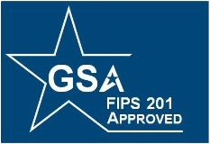

{:style="float:left"}

## Overview
This guide provides a list of common issues found during recent PIV/PIV-I card testing.  These issues are listed for one of two reasons:

*	The issue creates a FIPS 201-2 compliance issue and is a cause for failure of the annual FIPS 201 EP Testing
*	The issue creates problems with PACS interoperability

Before scheduling a date for in-person testing with the FIPS 201 EP program, please review the issues listed below and resolve any found to be on the sample production card to be used during testing.  A list of technical and policy guidance publications are included in the reference section of this document.

## Summary of Common Issues
This section provides a list of issues commonly found during FICAM annual PIV card testing.  The table below lists the issue topic and whether it is an “issue”, meaning a cause for failure if found during annual PIV card testing, or a “note”, meaning not a cause for failure, but should be addressed for consistency and compliance with established guidance.  The table also lists whether the topic applies to PIV, PIV-I, or both types of credentials.
Each entry topic is linked to its section below listing details and how to check for the issue.

Topic|Type| Credential Affected
---|---|---
[Missing entryUUID OID and cardUUID in Biometric Objects](#missing-entryuuid-oid-and-carduuid-object-in-biometric-objects)|Issue|PIV
[Cardholder Certificates Valid for Over 3 Years](#cardholder-certificates-valid-for-over-3-years)|Issue|PIV & PIV-I
[Missing UUID in the SAN Extension of the PIV Auth and Card Auth Certificates](#missing-uuid-in-the-san-extension-of-the-piv-auth-and-card-auth-certificates)|Issue|PIV
[Content Signing Certificate Does Not Assert `id-fpki-common-contentSigning`](#content-signing-certificate-does-not-assert-id-fpki-common-contentsigning)|Issue|PIV
[Facial Image Data Type Specifies Wrong Image Format](#facial-image-data-type-specifies-wrong-image-format)|Issue|PIV & PIV-I
[UUID Appears Before the FASC-N in the SAN Extension of the Card Auth Certifcate](#uuid-appears-before-the-fasc-n-in-the-san-extension-of-the-card-authentication-certificate)|Note|PIV
[Card Uses Deprecated Applet Version](#card-uses-deprecated-applet-version)|Note|PIV & PIV-I
[Printed Information Container Uses the ‘Employee Affiliation Line 2’ Tag](#printed-information-container-uses-the-employee-affiliation-line-2-tag)|Note|PIV & PIV-I
[Digital Signature Certificate Asserts Software Policy Rather Than Hardware](#digital-signature-certificate-asserts-software-policy-rather-than-hardware)|Note|PIV & PIV-I

---

### **Missing entryUUID OID and cardUUID Object in Biometric Objects**
This text will provide any reference information that may be needed to complete the steps outlined in the guide.

* This is a FIPS 201-2 non-compliance issue
* This issue applies to PIV credentials

#### *The Requirement*

The same 16-byte binary representation of the UUID value shall be present as the value of an `entryUUID` attribute, as defined in [IETF RFC 4530], in any CMS-signed data object that is required to contain a pivFASC-N attribute on a PIV Card, i.e., in the fingerprint template and facial image data objects.

All X.509 certificates in PIV cards must include the `entryUUID` OID and the Card UUID.  This applies to Cardholder Facial Image, Cardholder Fingerprints, and Cardholder Iris Images.

#### *How To Check This*

Running the NIST 85b test tool (PIV-I 1.1 based on PIV 6.2.0) will check the fingerprint and facial image objects for the presence of the `entryUUID` attribute.  The test tool will generate a "*Report.pdf*" file.  Near the end of the report, the tests “*CHECK_digital_signature_conformance #68 & #70*” will show “**Fail**” if the `entryUUID` attribute is not present.

This can also be checked by the Card Management System (CMS) provider/manager reviewing the signed attributes portion of the CBEFF signature block for the following:

The `entryUUID` OID (1.3.6.1.1.16.4) should be placed in the `signedAttrs` element of the `pivSigner-DN` (2.16.840.1.101.3.6.5), preferably just after the FASC-N in the `signedAttrs` element of the CMS as such:

```
SEQUENCE
  OBJECT: 2.16.840.1.101.3.6.6 (pivFASC-N)
  SET
    OCTET STRING      [HEX DUMP]:HHHHHHHHHHHHHHHHHHHHHHHHHHHHHHHHHHHHHHHHHHHHHHHHHH (25 octets)
SEQUENCE
  OBJECT: 1.3.6.1.1.16.4 (entryUUID)
  SET
    OCTET STRING       [HEX DUMP]:HHHHHHHHHHHHHHHHHHHHHHHHHHHHHHHH (16 octets)
```

#### References

* FIPS PUB 201-2  Personal Identity Verification (PIV) of Federal Employees and Contractors
[http://dx.doi.org/10.6028/NIST.FIPS.201-2](http://dx.doi.org/10.6028/NIST.FIPS.201-2)
* NIST Special Publication 800-73-4  Interfaces for Personal Identity Verification – Part 1: PIV Card Application Namespace, Data Model and Representation
[http://dx.doi.org/10.6028/nist.sp.800-73-4](http://dx.doi.org/10.6028/nist.sp.800-73-4)
* NIST Special Publication 800-76-2  Biometric Specifications for Personal Identity Verification
[http://dx.doi.org/10.6028/NIST.SP.800-76-2](http://dx.doi.org/10.6028/NIST.SP.800-76-2)
* ANSI INCITS 398:2008 American National Standard for Information Technology - Common Biometric Exchange Formats (CBEFF)
(Can be purchased from the ANSI website - [http:/webstore.ansi.org](http:/webstore.ansi.org))
* RFC 5652:  Cryptographic Message Syntax (CMS)
[https://tools.ietf.org/html/rfc5652](https://tools.ietf.org/html/rfc5652)

---

### **Cardholder Certificates Valid for Over 3 Years**

* This is a FIPS 201-2 non-compliance issue
* This issue applies to PIV & PIV-I credentials

#### *The Requirement*

The private keys corresponding to the public keys in these certificates have a maximum usage period of three years. [Section 6.3.2 of Common CP & FBCA CP]

#### *How To Check This*
Several cards presented for testing had certificates valid for slightly over three years.  This is usually an issue with how the CMS is configured to calculate the validity period and results in certificates issued with expiration dates of 3 years + ~1 day.

The certificate validity period can be checked by opening the cardholder certificates in MS Certificate Viewer, navigating to the "*Details*" tab, and scrolling down to compare the dates listed in the "*Valid From*" and "*Valid To*" fields to ensure the certificate has not been issued with an expiration greater than three (3) years.

This may be caused by the configuration used by the issuing CA or by a certificate template used by the CMS.  Check both the issuing CA and CMS systems if the certificates are found to be valid for over three (3) years.

#### References
* X.509 Certificate Policy for the U.S. Federal PKI Common Policy Framework
[https://www.idmanagement.gov/IDM/servlet/fileField?entityId=ka0t0000000POsaAAG&field=File__Body__s](https://www.idmanagement.gov/IDM/servlet/fileField?entityId=ka0t0000000POsaAAG&field=File__Body__s)
* X.509 Certificate Policy For The Federal Bridge Certification Authority (FBCA)
[https://www.idmanagement.gov/IDM/servlet/fileField?entityId=ka0t0000000POqtAAG&field=File__Body__s](https://www.idmanagement.gov/IDM/servlet/fileField?entityId=ka0t0000000POqtAAG&field=File__Body__s)

---

### **Missing UUID in the SAN Extension of the PIV Auth and Card Auth Certificates**

* This is a FIPS 201-2 compliance issue
* This applies to PIV credentials

#### *The Requirement*

Both PIV Authentication certificates and Card Authentication certificates must include a `subjectAltName` extension that includes the FASC-N from the PIV Card that holds the certificates. For certificates issued after October 15, 2015, the subjectAltName extension in the Card Authentication certificates must also include a UUID, but must not include any other name forms. The subjectAltName extension in PIV Authentication certificates may contain any name forms in addition to the FASC-N and UUID that are required by the various applications with which the certificate will be used. 

When the UUID appears in the `subjectAltName` extension of a certificate, it must be encoded as a uniformResourceIdentifier as specified in Section 3 of [RFC 4122].

An example of a UUID encoded as a URI, from RFC 4122, is `urn:uuid:f81d4fae-7dec-11d0-a765-00a0c91e6bf6`.

#### *How To Check This*

The `subjectAltName` extension can be checked by opening the cardholder certificates in MS Certificate Viewer, navigating to the "*Details*" tab, and scrolling down to the `Subject Alternative Name` field.

#### References

* X.509 Certificate Policy for the U.S. Federal PKI Common Policy Framework
[https://www.idmanagement.gov/IDM/servlet/fileField?entityId=ka0t0000000POsaAAG&field=File__Body__s](https://www.idmanagement.gov/IDM/servlet/fileField?entityId=ka0t0000000POsaAAG&field=File__Body__s)
* X.509 Certificate and Certificate Revocation List (CRL) Extensions Profile for the Shared Service Providers (SSP) Program
[https://www.idmanagement.gov/IDM/servlet/fileField?entityId=ka0t0000000Gmi3AAC&field=File__Body__s](https://www.idmanagement.gov/IDM/servlet/fileField?entityId=ka0t0000000Gmi3AAC&field=File__Body__s)

---

### **Content Signing Certificate Does Not Assert `id-fpki-common-contentSigning`**

* This is a FIPS 201-2 compliance issue
* This issue applies to PIV credentials

#### *The Requirement*

For signatures created on or after October 15, 2015,
the public key required to verify the digital signature shall be provided in the certificates field of the CMS
external digital signature in a content signing certificate, which shall be an X.509 digital signature
certificate issued under the `id-fpki-common-piv-contentSigning` policy of [COMMON].

#### *How To Check This*

The certificate can be checked by opening the 'X509_Certificate_Content_Signing_1' cardholder certificate in MS Certificate Viewer and navigating to the "*Details*" tab.

* To check when the certificate was issued, scroll down to the `Valid From` field.  If the `Valid From` date is on or after October 15, 2015, it should be using the `id-fpki-common-piv-contentSigning` policy OID.

* To check the certificate policy aserted, scroll down to the `Certificate Policies` field on the certificate viewer and look at the `Policy Identifier` OID listed.

>The policy OID for 'id-fpki-common-piv-contentSigning' is 2.16.840.1.101.3.2.1.3.39.  This should be the only OID listed in the `Certificate Policies` extension if the certificate was issued after October 15, 2015.
{:class="info"}

#### References

* X.509 Certificate Policy for the U.S. Federal PKI Common Policy Framework 
[https://www.idmanagement.gov/IDM/servlet/fileField?entityId=ka0t0000000POsaAAG&field=File__Body__s](https://www.idmanagement.gov/IDM/servlet/fileField?entityId=ka0t0000000POsaAAG&field=File__Body__s)
* X.509 Certificate and Certificate Revocation List (CRL) Extensions Profile for the Shared Service Providers (SSP) Program
[https://www.idmanagement.gov/IDM/servlet/fileField?entityId=ka0t0000000Gmi3AAC&field=File__Body__s](https://www.idmanagement.gov/IDM/servlet/fileField?entityId=ka0t0000000Gmi3AAC&field=File__Body__s)
* NIST Computer Security Objects Register (CSOR) Public Key Infrastructure (PKI) Objects Registration [http://csrc.nist.gov/groups/ST/crypto_apps_infra/csor/pki_registration.html](http://csrc.nist.gov/groups/ST/crypto_apps_infra/csor/pki_registration.html)

---

### **Facial Image Data Type Specifies Wrong Image Format**

* This is an interoperability note
* This note applies to PIV and PIV-I credentials

#### *The Issue*

Facial images stored on PIV/PIV-I credentials must be formatted in either JPEG or JPEG 2000 format.  It is recommended for agencies to use ISO/IEC 15444 compression (JPEG 2000) format for newly captured facial images, but older ISO/IEC 10918 (JPEG) formatted facial images are allowed for “legacy” or previously recorded images not yet expired (The biometric data in the chain-of-trust shall be valid for at most 12 years per FIPS 201-2).
However, the image format **must match** the data type specified in the `Image Data Type` of the facial image.
```
0 = JPEG
1 = JPEG 2000
```
Facial images stored on a PIV/PIV-I credential with the incorrect CBEFF Facial Image Data Type specified may cause the PACS system to be unable to decompress and read the facial image data stored on the card.

#### *How To Check This*

The format of the facial image stored on the card should be checked against the `Image Data Type` value of the facial image.

#### References

*	[FACESTD] ANSI INCITS 385:2004 American National Standard for Information Technology - Face Recognition Format for Data Interchange.
(Can be purchased from the ANSI website - [http:/webstore.ansi.org](http:/webstore.ansi.org))
*	NIST Special Publication 800-76-2  Biometric Specifications for Personal Identity Verification
[http://dx.doi.org/10.6028/NIST.SP.800-76-2](http://dx.doi.org/10.6028/NIST.SP.800-76-2)
*	FIPS PUB 201-2  Personal Identity Verification (PIV) of Federal Employees and Contractors
[http://dx.doi.org/10.6028/NIST.FIPS.201-2](http://dx.doi.org/10.6028/NIST.FIPS.201-2)

---

### **UUID Appears Before the FASC-N in the SAN Extension of the Card Authentication Certificate**

*	This is an interoperability note
*	This note applies to PIV credentials

#### *The Issue*

While the UUID is required in the `SubjectAltName` extension (SAN) for both PIV and PIV-I credentials, there is no requirement specifying the order in which the UUID and FASC-N should appear in the `SubjectAltName` extension in certain types of X.509 certificates.  The normative practice is for newer items, in this case the UUID, to be placed after existing elements, here, the FASC-N.

Reversing the order to place the UUID before the FASC-N in the SAN has caused some PACS systems to not recognize the PIV Authentication and/or Card Authentication certificates as PIV-compliant.  This problem is being addressed with PACS vendors.  It is recommended that PIV credentials be configured with the UUID appearing after the FASC-N in the Card Auth SAN extension.  Holders of PIV credentials with the UUID appearing first may experience interoperability issues and be unable to register the PIV card with other FPKI PACS systems. 

#### *How To Check This*

The `subjectAltName` extension can be viewed by opening the cardholder certificates in MS Certificate Viewer, navigating to the "*Details*" tab, and scrolling down to select the `Subject Alternative Name` field.  

The FASC-N will be displayed as 
```
Other Name:
 2.16.840.1.101.3.6.6=[Hex string]
``` 
An example UUID would be displayed as
```
URL=urn:uuid:f81d4fae-7dec-11d0-a765-00a0c91e6bf6
```

---

### **Card Uses Deprecated Applet Version**

*	This is a FIPS 201-2 compliance note
*	This note applies to PIV credentials

#### *The Issue*

In-line with the Deterministic Random Bit Generators (DRBG) PIV card transition plan from NIST, the FIPS 201 Evaluation Program will be removing legacy Random Number Generator (RNG) PIV cards listed on the Approved Products List on **July 31, 2017**.

According to this transition plan, agencies may continue to procure and issue cards using implementations marked as “legacy” on the NPIVP validation list until June 30, 2017. However, the agencies should migrate to fully compliant cards implementing approved DRBGs as soon as DRBG PIV cards and the compatible card management software are commercially available. Once issued, these “legacy” RNG PIV cards may be used until their expiration date - **up to June 30, 2023**.

#### *How To Check This*

Running the NIST 85b test tool (PIV-I 1.1 based on PIV 6.2.0) will check the card data model and applet version.  The test tool will generate a "*Report.pdf*" file.  In the report, the test “*CHECK_certificate_profile_conformance #110*” will list the data model and applet version in the “*Actual*” column.  This can be checked against the NIST PIVP Applet Validation List (included in the references below) to determine if the card is using a deprecated applet.

#### References

*	NIST Personal Identity Verification Program:  Validation List for PIV Card Applications
[http://csrc.nist.gov/groups/SNS/piv/npivp/validation_lists/PIVCardApplicationValidationList.htm](http://csrc.nist.gov/groups/SNS/piv/npivp/validation_lists/PIVCardApplicationValidationList.htm)
*	NIST Personal Identity Verification Program Announcement – August 06, 2016
[http://csrc.nist.gov/groups/SNS/piv/npivp/announcements.html#080516](http://csrc.nist.gov/groups/SNS/piv/npivp/announcements.html#080516)
*	FIPS 201 Evaluation Program Announcements:  June 23, 2016
[https://www.idmanagement.gov/IDM/s/article_detail?link=fips-201-announce](https://www.idmanagement.gov/IDM/s/article_detail?link=fips-201-announce)

---

### **Printed Information Container Uses the ‘Employee Affiliation Line 2’ Tag**

*	This is a FIPS 201-2 compliance note
*	This note applies to PIV & PIV-I credentials

#### *The Issue*

The update to NIST SP 800-73-3 in February 2010 removed the Printed Information’s Employee Affiliation Line 2 data element (tag 0x03) because it no longer had a corresponding text field on the face of the card. In order to successfully match the printed information for verification on Zone 8F (Employee Affiliation) and Zone 10F (Agency, Department, or Organization) on the face of the card with the printed information stored electronically on the card, agencies should use tags 0x02, 0x07, & 0x08.

#### *How To Check This*

Running the NIST 85b test tool (PIV-I 1.1 based on PIV 6.2.0) will check the card data model and applet version.  The test tool will generate a "*Report.pdf*" file.  In the report, the test “*CHECK_BER_TLV_conformance #7*” will display “Test Failed: PrintedInformation should not have content at tag 0x3: Employee Affiliation Line 2 has been eliminated.” in the “Actual” column.

#### References

*	NIST Special Publication 800-73-4  Interfaces for Personal Identity Verification – Part 1:  PIV Card Application Namespace, Data Model, and Representation
[http://dx.doi.org/10.6028/nist.sp.800-73-4](http://dx.doi.org/10.6028/nist.sp.800-73-4)

---

### **Digital Signature Certificate Asserts Software Policy Rather Than Hardware**

*	This is an interoperability note
*	This note applies to PIV credentials

#### *The issue*

While this is allowed, it should be noted that a software policy is not expected on the signature cert on a PIV card as it would not be valid for signing PDFs according to Adobe.

#### *How To Check This*

The `Certificate Policies` extension can be checked by opening the cardholder certificates in MS Certificate Viewer, navigating to the "*Details*" tab, and scrolling down to the `Certificate Policies` field.  The policy OID can be checked against the CSOR PKI Objects Registration list (included in the References below) if you are unsure whether the policy asserted is a software or hardware policy. 

#### References

*	NIST Computer Security Object Registration (CSOR) Public Key Infrastructure (PKI) Objects Registration
[http://csrc.nist.gov/groups/ST/crypto_apps_infra/csor/pki_registration.html](http://csrc.nist.gov/groups/ST/crypto_apps_infra/csor/pki_registration.html)
