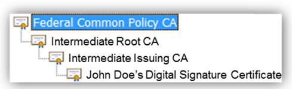
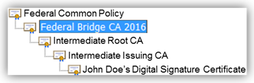

### Certification Authorities

This page will provide you with general information about the Federal PKI Certification Authorities. If you are unfamiliar with the term Certification Authority, you can [learn more about Certification Authorities and Public Key Infrastructure on this page](../pki/).

### Federal PKI Trusted Infrastructure Certification Authorities
[{:style="width:35%;float:right;"}](https://raw.githubusercontent.com/djpackham/fpki-guides/gh-pages/img/fpki_trust_cas.png)
*FPKI Trust Infrastructure (Click to Zoom)*{:style="float:right;font-size:14px;clear:both;text-align:center;margin:20px 0 0 0;width:40%;"}
The FPKI Trust Infrastructure is the backbone of the FPKI hierarchy. It consists of three main certification authorities (CAs) operated by the FPKI Management Authority (FPKIMA). 

* [Federal Common Policy Certification Authority (COMMON)](#federal-common-policy-certification-authority-common---the-root)
* [Federal Bridge Certification Authority (FBCA)](#federal-bridge-certification-authority-fbca)
* [SHA-1 Federal Root Certification Authority (_SHA1 FRCA_)](#sha-1-federal-root-certification-authority-sha1-frca)

The FPKIMA is an organization established by the Federal government to manage, operate and maintain the FPKI CA infrastructure services for Federal, public and private constituents. The three main CAs are referred to as FPKI Trust Infrastructure CAs. Any CA in the FPKI can be referred to as a “FPKI CA,” but only these operated by the FPKIMA are FPKI Trust Infrastructure CAs and they are the highest level CAs in the FPKI trust hierarchy. These next sections describe the three Trusted Infrastructure CAs.





#### Federal Common Policy Certification Authority (_COMMON_) - the root ####

{:style="width:40%;float:right;"}
*Example of COMMON as the Trust Anchor*{:style="float:right;clear:both;font-size:14px;text-align:center;margin:20px 0 0 0;width:40%;"}
For the US Federal Government Executive branch agencies, there is one Root Certification Authority (aka trust anchor) named Federal Common Policy Certification Authority (COMMON). COMMON serves as the Federal PKI (FPKI) trust anchor for the Federal Government in support of [Homeland Security Presidential Directive-12 (HSPD-12)](https://www.dhs.gov/homeland-security-presidential-directive-12) and [Personal Identity Verification (PIV) cards](https://gsa.github.io/piv-guides/#what-is-piv). COMMON was designed so any certificate issued by an FPKI CA can validate to a single point. For example, see the example to the right where a person certificate, issued by a FPKI CA, can validate its certificate path back to COMMON.

The Federal Common Policy CA is public facing and its root certificate is distributed by commercial vendors who include it in their commercial off the shelf product [trust stores](../truststores/).  This enables Federal Government systems to be able to trust FPKI person and device certificates issued by FPKI CAs. It is also possible to manually add the Federal Common Policy CA into trust stores, if it is not available by default.





#### Federal Bridge Certification Authority (_FBCA_)

{:style="float:left;width:15%;"}
The Federal Bridge Certification Authority (FBCA) is the PKI Bridge or link between the Federal Common Policy CA and the other CAs that comprise the FPKI, including Federal and external PKIs, commercial organizations, state, local, and foreign governments. The FBCA provides a means to map participating PKIs so they validate to the Federal Common Policy Certification Authority trust anchor.

{:style="width:40%;float:right;"}
*Example of a FBCA Certification Path*{:style="float:right;clear:both;font-size:14px;text-align:center;margin:20px 0 0 0;width:40%;"}The FBCA enables peer-to-peer transactions between its member organizations, both Federal and Non-Federal. Members of the FBCA are cross-certified, meaning they've established a trust relationship, with the FBCA. These relationships include FPKI Trusted Infrastructure CAs, Shared Service Provider CAs, and participating individual Federal agency or other organizational CAs. These partners have extended the reach of the FPKI well beyond the boundaries of the Federal Government. 

Current CAs that are cross-certified are found on the [FPKI Approved Providers page](https://www.idmanagement.gov/IDM/s/article_detail?link=fpki-approved-providers), under the *Federal Bridge Affiliate* category.



#### SHA-1 Federal Root Certification Authority (_SHA1 FRCA_)

The SHA-1 Federal Root CA (SHA-1 FRCA) is a Federal CA supporting Federal entities that still require using certificates that have the deprecated SHA-1 signature hash algorithm. The SHA-1 hash algorithm is an older algorithm that has been deemed to be not secure enough for today’s standards.  Federal organizations should no longer be using certificates with this hash.  However, it is difficult and costly for organizations to quickly switch to stronger algorithms because some applications used in the FPKI community cannot process certificates using the more secure SHA-256 algorithm. Therefore, a new parallel SHA-1 FPKI CA was created to facilitate the interoperability for those unable to transition to SHA-256.





{:style="width:35%;float:right;"}

### FPKI Participating Certification Authorities

A Certification Authority that is connected with the FPKI is called a *Participating Certification Authority*. Participating Certification Authorities include commercial, federal, state, local or foreign government, or federal legacy Certification Authorities. The following sections describe the various FPKI Participating Certification Authorities.

#### Shared Service Provider Certification Authorities

A Shared Service Provider (SSP) CA is *subordinate* to the Federal Common Policy CA (FCPCA) which means its Root Certificate has been signed and issued by another Certification Authority, in this case the FCPCA. Any certificate the SSP CA creates, signs and issues to people or devices are in the trust chain of the FCPCA. An SSP CA implementation must go through a certification process and must adhere to strict IT security and Federal policy standards and requirements.  Once they meet these specifications, the SSP organization receives an Authority to Operate (ATO) and is contracted by the Federal government to issue certificates to Federal employees, contractors and Federal devices that are deployed in Federal agency networks.

Current SSP CAs that are issuing certificates are found on the [FPKI Approved Providers page](https://www.idmanagement.gov/IDM/s/article_detail?link=fpki-approved-providers), under the *Shared Service Providers* category.

#### Private Sector Certification Authorities

A Private Sector Certification Authority that is cross-certified with the FBCA has shown a valid need to either conduct business or provide PKI services to the Federal government. These CAs are often referred to as Non-Federal Issuers (NFIs).

#### Access Certificates for Electronic Services (ACES) Certification Authorities

In a similar service model to the SSP program, which issues certificates to Federal employees or devices, the ACES CA issues certificates to U.S. citizens, authorized business representatives and unaffiliated Non-Federal individuals who have demonstrated need to access Federal network systems.  This provides a method of authenticating external users who are authorized to access Federal resources.

#### Other Bridge Certification Authorities

Bridge CAs connect member PKIs and are designed to enable interoperability between different PKIs operating under their own Certificate Policy. A Bridge CA is not intended to be used as a trust anchor. 

#### Other Government Certification Authorities

These are CAs managed and operated by state, local, or foreign government organizations. 

### Federal Agency Legacy PKIs

OMB Memo 05-05, issued in 2004, directed all Federal agencies to use the SSP CA program instead of establishing their own self-managed PKI unless they were already operating a PKI. There were a number of agencies that had already deployed and invested significant funding into their own PKI. Some of these agencies opted out of migrating to the SSP CA program and continue to manage their own existing infrastructures. These Federal Agency Legacy PKIs operate an internal PKI that is cross-certified with one or more FPKI Trust Infrastructure CAs.
