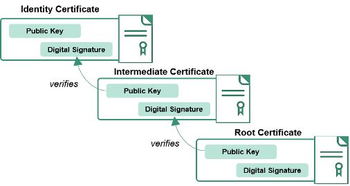

The Federal Public Key Infrastructure encompasses the Certification Authorities which issue:

1. PIV credentials and person identity certificates
2. PIV-Interoperable credentials and person identity certificates
3. Other person identity certificates
4. Device identity certificates

The participating Certification Authorities **and** the Policies, Processes, and Auditing of all the participants is referred to as the **Federal Public Key Infrastructure (FPKI)**

## Example
To give a simple example, we'll explain the PIV certificates.  Although we have many other types of identity certificates, it's easiest to explain with **PIV** since you might have one:

* Identity certificates are issued and digitally signed by a _Certification Authority_.  
* The _Certification Authority_ that issued and digitally signed your PIV certificates is called an _Intermediate Certification Authority_ because it was issued a certificate by another _Certification Authority_.  
* This process of issuing and signing continues until there is one  _Certification Authority_ that is called the _Root Certification Authority_.

The full process of proving identity when issuing the certificates, auditing the certification authorities, and the cryptographic protections of the digital signatures establish the basis of Trust.

{:style="float:center"}

The US Federal Government has also established Trust with other Certification Authorities which serve business communities, State and Local government communities, and international government communities.

For the US Federal Government Executive branch agencies, there is one Root Certification Authority named _Federal Common Policy Certification Authority (COMMON)_, and dozens of Intermediate Certification Authorities, and Bridged Certification Authorities.  

*  [A graph of the federal public key infrastructure, including the business communities](https://fpki-graph.fpki-lab.gov/){:target="_blank"}

<!-- TODO: Reuse same information and visuals from here https://github.com/GSA/piv-guides/blob/staging/pages/certchains.md -->
